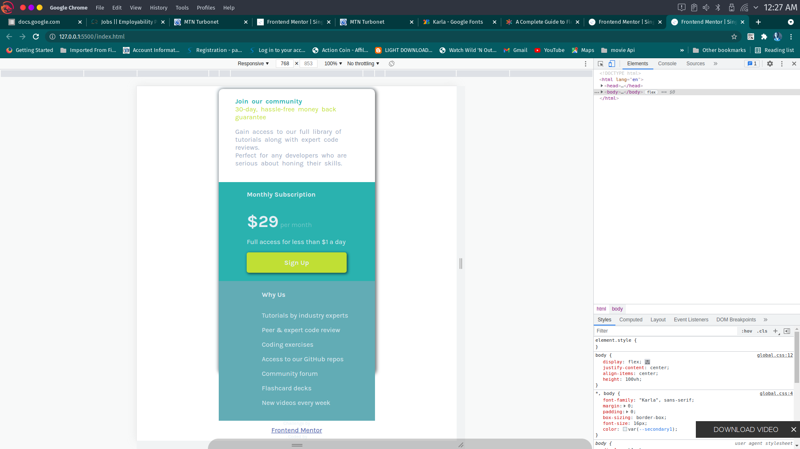

## Overview

### The challenge

Users should be able to:

- View the optimal layout for the component depending on their device's screen size
- See a hover state on desktop for the Sign Up call-to-action

### Screenshot

### Links

- Solution URL:(https://github.com/zark28/price-grid-challenge.git)
- Live Site URL:(https://zark28.github.io/price-grid-challenge/)

## My process

### Built with

- Semantic HTML5 markup
- CSS custom properties
- Flexbox
- CSS Grid

### What I learned

I am taking these challnges to revise my html css and js knowledge as i have been off coding foe a while.

If you want more help with writing markdown, we'd recommend checking out [The Markdown Guide](https://www.markdownguide.org/) to learn more.

### Continued development

Moving forward will like to focus more on grid css properties and mobile first work-flow

### Useful resources

---

## Author

- Website - [Abdul-Razak Adams](https://github.com/zark28)

- Frontend Mentor - [@zark28](https://www.frontendmentor.io/profile/zark28)

- Twitter - [@adamsabdulraza2](https://twitter.com/adamsabdulraza2)

## Acknowledgments

---
